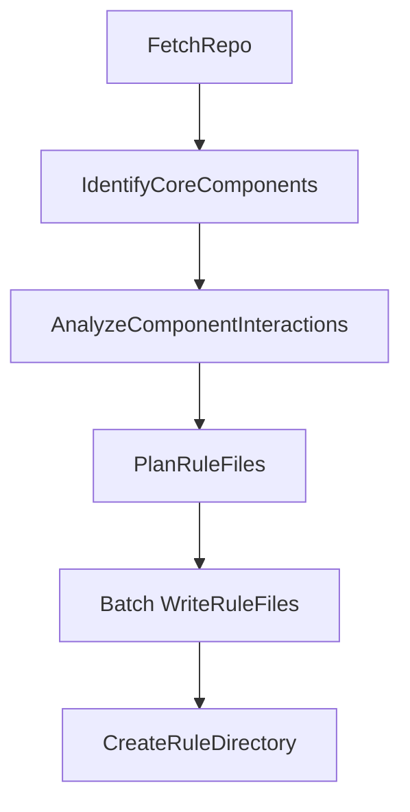

# Refactoring Design: Codebase to Cursor Rules Generator

## 1. Requirements (Revised)

**Goal:** Refactor the existing codebase knowledge builder to generate a `.cursor/rules` file from a GitHub repository or local directory. These rules should help Cursor's AI understand the project's structure, core components, and interactions to provide better coding assistance.

**User Story:** As a developer using Cursor, I want to automatically generate a `.cursor/rules` file for a given codebase (GitHub repo or local directory). This file should contain concise, factual rules about the project's main components (classes, functions, modules) and how they interact, enabling Cursor's AI to offer more context-aware suggestions and explanations during development.

**Input:**

- A publicly accessible GitHub repository URL or a local directory path.
- Project name (optional, derived if not provided).
- GitHub token (optional).
- Include/Exclude patterns (optional).
- Max file size (optional).

**Output:**

- A directory named `.cursor/rules` (or located within a specified output path, e.g., `output_dir/project_name/.cursor/rules/`) containing multiple `.mdc` files. Each `.mdc` file will contain formatted, fact-based rules about a specific aspect of the codebase (e.g., core components, interactions, specific module details). Files may include metadata (YAML frontmatter) to guide Cursor on when to apply the rule (e.g., always, based on file globs).

**Key Differences from Original:**

- **Target Audience:** AI (Cursor) instead of Humans.
- **Output Format:** `.cursor/rules` directory with multiple `.mdc` files instead of multi-file Markdown tutorial.
- **Content Focus:** Factual code components and interactions instead of high-level abstractions, analogies, and narrative chapters.
- **No Translation:** Rules will be generated in English.

## 2. Flow Design (Revised)

### Applicable Design Pattern

This refactored project uses a **Workflow** pattern, incorporating **Batch Processing** for generating individual rule files.

### Flow High-level Design

1. **`FetchRepo`**: (Same as original) Crawls the specified source and retrieves relevant source code file contents.
2. **`IdentifyCoreComponents`**: (Same as previous plan) Analyzes the codebase using an LLM to identify key programmatic components and their defining file paths.
3. **`AnalyzeComponentInteractions`**: (Same as previous plan) Uses an LLM to analyze components and code to determine key interactions between them.
4. **`PlanRuleFiles` (New)**: Determines the structure of the `.cursor/rules` directory. Decides which `.mdc` files to create (e.g., one for general components, one for interactions, potentially separate files for major modules/features based on component analysis) and what data source each file should use. It might define basic metadata (like `alwaysApply: true` for a core overview file).
5. **`WriteRuleFiles` (BatchNode)**: Iterates through the plan created in the previous step. For each planned `.mdc` file, it fetches the relevant data (components, interactions, etc.), formats it into fact-based Markdown suitable for AI consumption, adds the planned metadata as YAML frontmatter, and generates the final `.mdc` file content.
6. **`CreateRuleDirectory` (New)**: Creates the `.cursor/rules` directory structure and writes each generated `.mdc` file content to its corresponding file within that directory.



## 3. Utility Functions (Unchanged Necessity)

1. **`crawl_github_files`** (`utils/crawl_github_files.py`) - Required by `FetchRepo` for GitHub sources.
2. **`crawl_local_files`** (`utils/crawl_local_files.py`) - Required by `FetchRepo` for local sources.
3. **`call_llm`** (`utils/call_llm.py`) - Used by `IdentifyCoreComponents` and `AnalyzeComponentInteractions` (and potentially `GenerateCursorRules`).

## 4. Node Design (Revised)

### Shared Store (Revised)

```python
shared = {
    # --- Inputs (Mostly Unchanged) ---
    "repo_url": None,
    "local_dir": None,
    "project_name": None,
    "github_token": None,
    "output_dir": "output", # Base output directory, final path will be output_dir/project_name/.cursor/rules
    "include_patterns": set(),
    "exclude_patterns": set(),
    "max_file_size": 100000,

    # --- Intermediate/Output Data (Revised) ---
    "files": [], # Output of FetchRepo: List of tuples (file_path: str, file_content: str)
    "components": [], # Output of IdentifyCoreComponents: List of {"name": str, "type": str, "defining_files": [str]}
    "interactions": [], # Output of AnalyzeComponentInteractions: List of {"source": str, "type": str, "target": str, "file": str}
    "rule_files_plan": [], # Output of PlanRuleFiles: List of {"filename": str, "data_source": str/dict, "metadata": dict}
    "mdc_files_content": {}, # Output of WriteRuleFiles: Dict {"filename.mdc": "file content string"}
    "cursor_rules_dir_path": None # Output of CreateRuleDirectory: Path to the generated .cursor/rules directory
    # "cursor_rules_content", "cursor_rules_path" removed/renamed
    # "abstractions", "relationships", "chapter_order", "chapters", "final_output_dir" removed
}
```

### Node Steps (Revised)

1. **`FetchRepo`**
    - *Purpose*: Download/read code.
    - *Type*: Regular
    - *Steps*: (Unchanged)
        - `prep`: Read inputs. Derive `project_name` if needed.
        - `exec`: Call appropriate crawler utility. Convert result to list of `(path, content)` tuples.
        - `post`: Write `files` list and `project_name` to shared store.

2. **`IdentifyCoreComponents`**
    - *Purpose*: Identify key code components.
    - *Type*: Regular
    - *Steps*: (Unchanged from previous plan)
        - `prep`: Read `files`, `project_name`. Format context.
        - `exec`: Call LLM to identify components, type, defining files. Request YAML output. Parse/validate.
        - `post`: Write `components` list to shared store.

3. **`AnalyzeComponentInteractions`**
    - *Purpose*: Determine direct interactions between core components.
    - *Type*: Regular
    - *Steps*: (Unchanged from previous plan)
        - `prep`: Read `components`, `files`. Format context.
        - `exec`: Call LLM to identify interactions (source, type, target, file). Request YAML output. Parse/validate.
        - `post`: Write `interactions` list to shared store.

4. **`PlanRuleFiles`** (New)
    - *Purpose*: Define the structure and content plan for `.mdc` rule files.
    - *Type*: Regular
    - *Steps*:
        - `prep`: Read `components`, `interactions`.
        - `exec`: Analyze components/interactions to decide on file structure. E.g., create a plan like `[{"filename": "core_components.mdc", "data_source": "components", "metadata": {"alwaysApply": True, "description": "Overview of key project components"}}, {"filename": "interactions.mdc", "data_source": "interactions", "metadata": {"description": "How core components interact"}}, ...]`. Could potentially create files per major module if identifiable. Logic might be rule-based or use a simple LLM call for planning.
        - `post`: Write the plan list to `shared["rule_files_plan"]`.

5. **`WriteRuleFiles`** (New **BatchNode**)
    - *Purpose*: Generate the content for each planned `.mdc` file.
    - *Type*: **BatchNode**
    - *Steps*:
        - `prep`: Read `rule_files_plan`, `components`, `interactions`. Return `rule_files_plan` as the iterable.
        - `exec(item)`: Takes one item from the plan (`{"filename": ..., "data_source": ..., "metadata": ...}`). Fetches the relevant data based on `data_source` (e.g., `shared["components"]`). Formats this data into concise, fact-based Markdown. Could use an LLM for summarization or structuring if needed, ensuring an AI-friendly tone. Prepends the YAML frontmatter based on `item["metadata"]`. Returns a tuple `(item["filename"], generated_content)`.
        - `post(shared, prep_res, exec_res_list)`: `exec_res_list` contains tuples like `("core_components.mdc", "--- metadata ---\n\nContent...")`. Convert this list into a dictionary `{filename: content}` and store it in `shared["mdc_files_content"]`.

6. **`CreateRuleDirectory`** (New)
    - *Purpose*: Create the `.cursor/rules` directory and write the `.mdc` files.
    - *Type*: Regular
    - *Steps*:
        - `prep`: Read `mdc_files_content`, `project_name`, `output_dir`. Determine the final output directory path (e.g., `os.path.join(output_dir, project_name, ".cursor", "rules")`).
        - `exec`: Create the target directory path, including intermediate directories like `.cursor/`. Iterate through the `mdc_files_content` dictionary and write each value (content) to a file named by the key within the target directory.
        - `post`: Store the final directory path in `shared["cursor_rules_dir_path"]`. Log completion.
